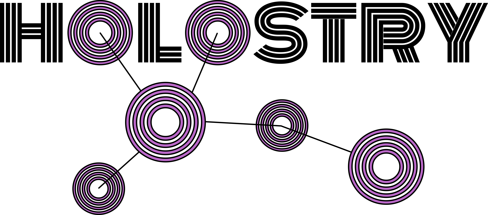
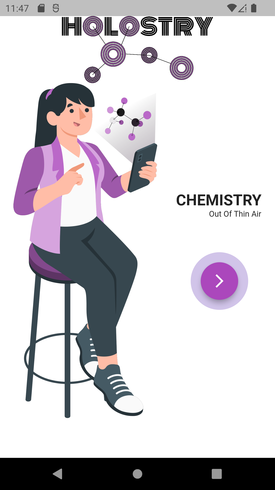
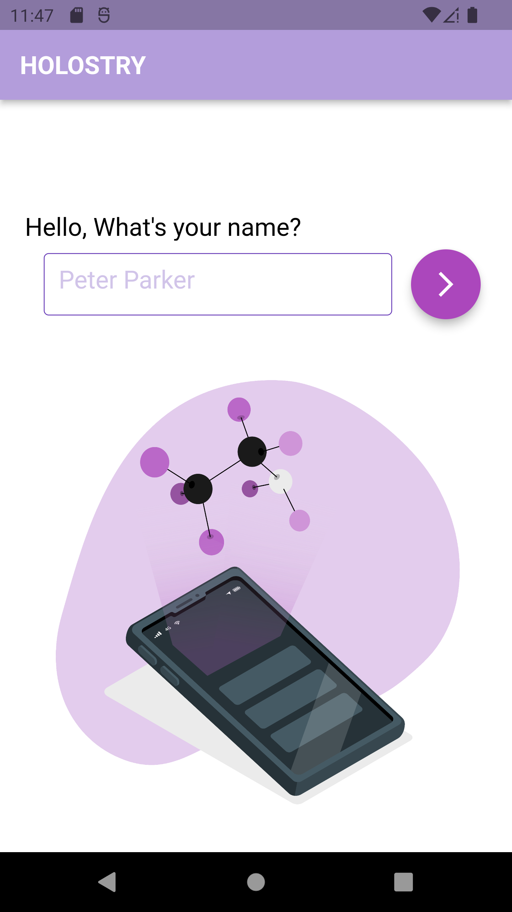
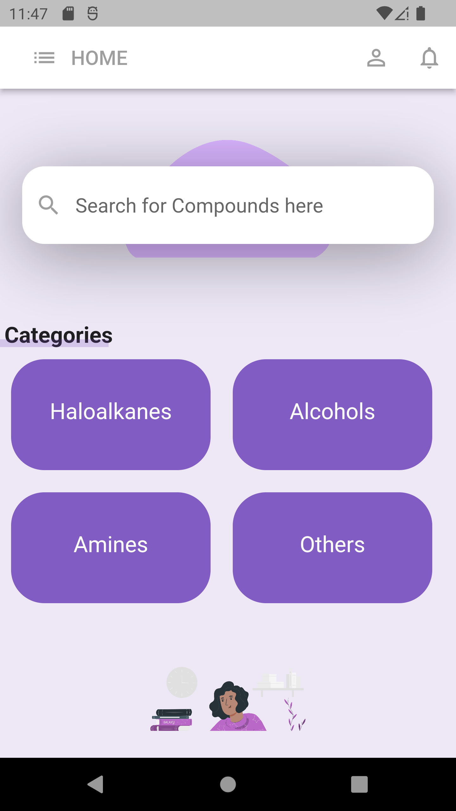
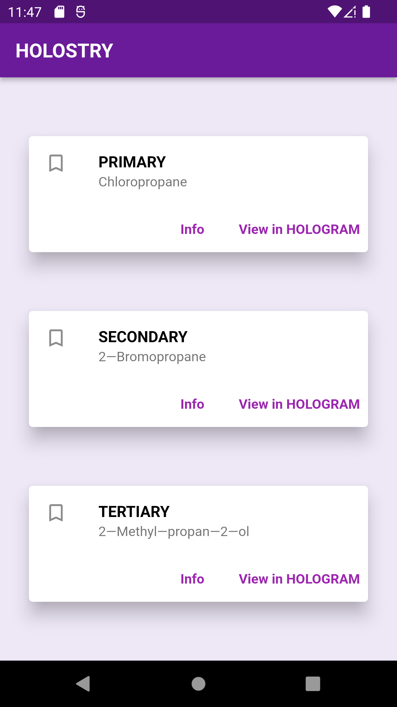
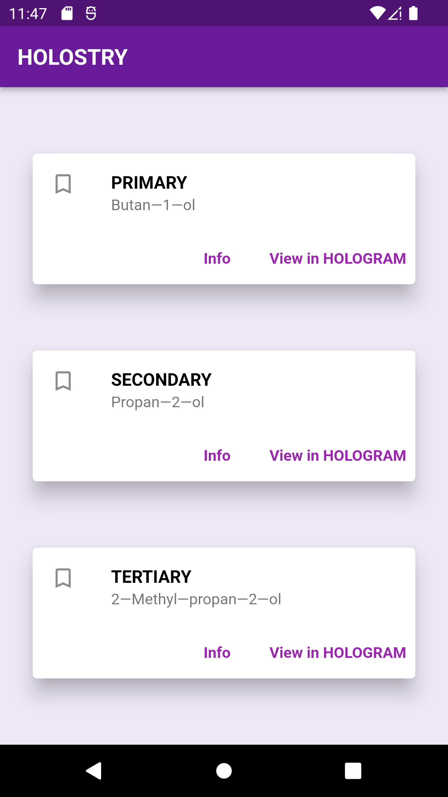
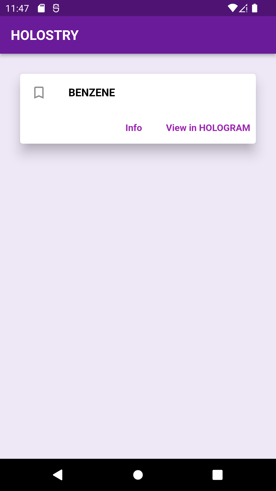

#                                                 CHEMISTRY OUT OF THIN AIR

## About Holostry

An app which aims at revolutionizing education, was grounded up in 24 hours for India's most prestigious hackathon - MOZOHACK. It provides the user with a DIY hologram-projector video and gives them a library of Carbon Compound Holographic gifs. When the projector is placed at the middle, a 3D model is visible.

## The problem it solves

Holostry solves the problem of visualization in learning. We've all found ourselves trying hard to visualize how a particular carbon compound blackboard-diagram would look like in real life. Visualization makes learning enjoyable, enhances attention, keeps one focused on the subject matter and increases one's understanding of each concept. Chemistry is hard to grasp as students don't find it as relatable as Physics (which one can see in real life), Holostry makes Chemistry closer and approachable for each student.

https://user-images.githubusercontent.com/91268240/181503884-e1a32686-a474-44e1-ae8d-1e372891a348.mp4

## Technologies we used

1. Flutter
2. Dart
3. blender
4. Android Studio
5. Inkspace

# Our Team

- [cereal-hecker](https://www.github.com/cereal-hecker)

- [Dksie09](https://www.github.com/Dksie09)

- [MaybeTarun](https://linktr.ee/tarun2003)

- [awxsoul](https://www.github.com/awxsoul)

## Some Screenshots of our app

## Challenges we ran into

We knew a little web development but Holostry required an app, website didn't make sense because a user can't put their hologram projector on and thus we had to learn App Development (Flutter) in two days.
We needed to create 3D carbon compounds and then their holographic videos. A special format, different than normal videos, is required for those and thus one of us had to learn blender to render our compounds.
